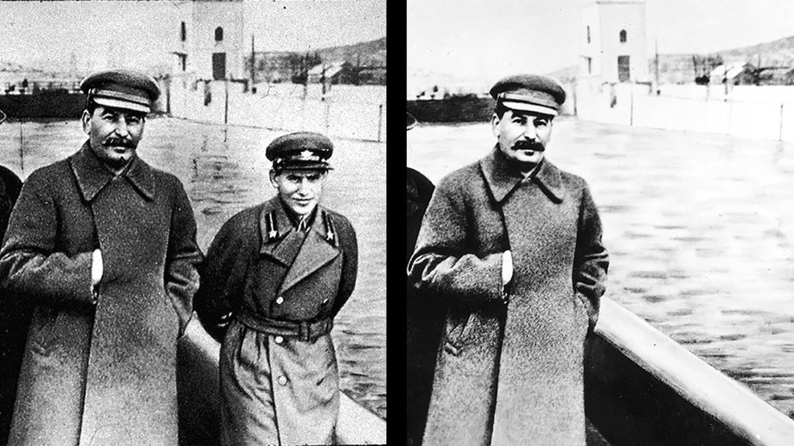
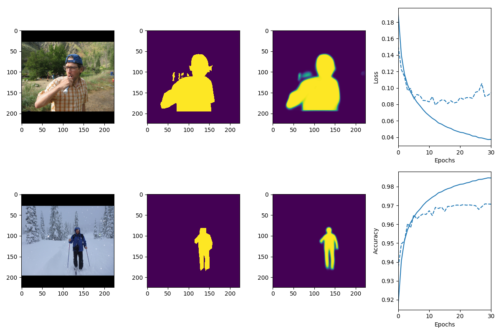
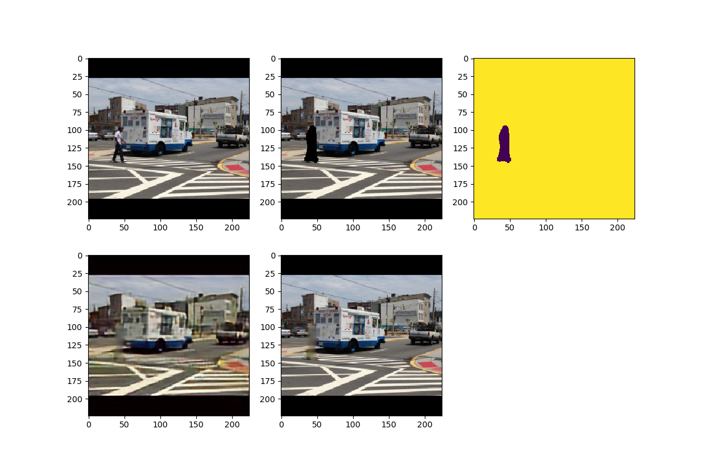
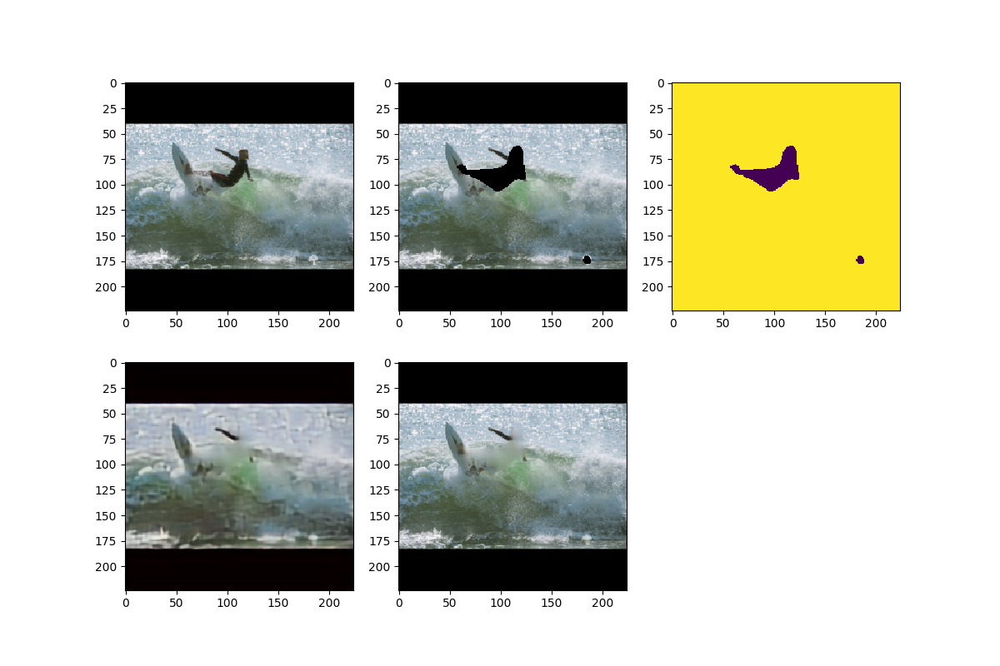
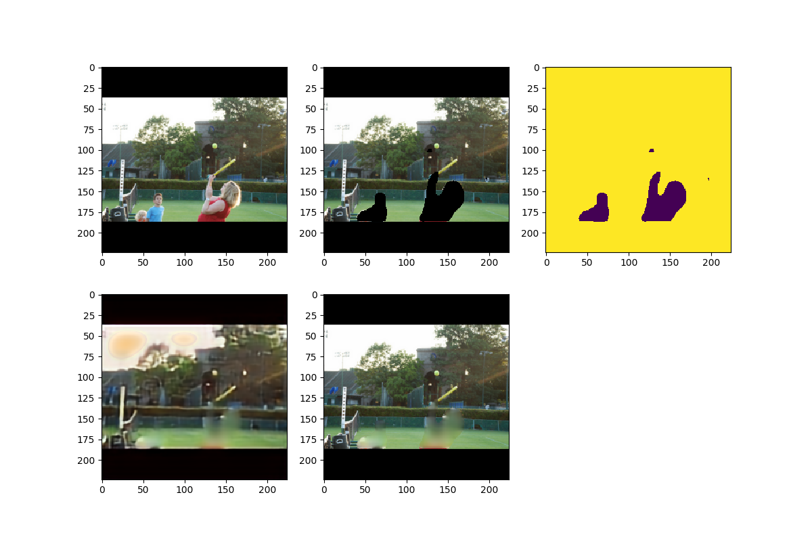

# The Vanisher Network

May 2018

The idea of this project is to remove artificial items from a photo, e.g. cars, buildings, or people in nature photograpy. This is not a new idea -- removing people from photos has some dark history to it.

The project is composed of two parts (two neural nets):

## Part 1: Image segmentation

Identifying people in photos -- trained on 68k photos with humans [Coco dataset](http://cocodataset.org/#home) and 5k photos without humans. The photos are RGB and rescaled to 224 x 224.

A encoder - decoder network was used:

2x 2D Conv layers of 224x224x64 + ReLU + Batch Normalization + Max Pooling 2D
2x 2D Conv layers 112x112x128 + ReLU + BN + MP 2D
2x 2D Conv layers 56x56x256 + ReLU + BN + MP 2D
2x 2D Conv layers 28x28x512 + ReLU + BN + MP 2D
1x 2D Conv layer 14x14x512 + ReLU + BN + MP 2D
1x 2D Transpose Conv layer 14x14x512 + ReLU + BN + Upsampling 2D
1x 2D Transpose Conv layer 14x14x512 + ReLU + BN + US 2D
2x 2D Transpose Conv layers 28x28x512 + ReLU + BN + US 2D
2x 2D Transpose Conv layers 56x56x256 + ReLU + BN + US 2D
2x 2D Transpose Conv layers 112x112x128 + ReLU + BN + US 2D
2x 2D Transpose Conv layers 224x224x64 + ReLU + BN + US 2D
1x 2D Transpose Conv layer 2224x224x1 -> Final bit mask indicating 0 or 1 whether the bit is part of a person

Total is about 30M free params

Ran for 30 epochs, overfitting started after ~15 epochs. The photo below shows one pic from the dataset and one from the test set. About 97% accuracy on the validation dataset was achieved.

## Part 2: Image imprinting

We need a second network to refill the segments where people used to be, as well as possible. This process is called image imprinting, the current state of the art is [DeepFill v2](https://github.com/JiahuiYu/generative_inpainting) which uses Attention & GANs.

For this project, an easier solution was used -- an autoencoder similar to the one used in step 1, trained on the [Places dataset](http://places2.csail.mit.edu/). The input was rescaled to 224x224 x 3 channels (RGB). Random parts of the image (5-10%) were removed from the original, and removed parts were added to the input as a fourth channel bitmask.

## Part 3: End to end

The end to end script uses the networks trained in Part 1 and Part 2 in predict mode, to generate photos with people removed:

The original image is run through the network in Part 1, resulting in a mask that detected the people in the photo.
The people are cut from the original image, and a mask that indicates where the cuts were made is added as a fourth channel in the resulting image.

The four channel image is ran through the second network, which results in a 3 channel RGB image with the person removed, and in its place an imprint that looks like the surrounding area.

## Results

Here are some imprinted photos. The original is on the upper left. The person is masked out, with the mask shown in the upper right photo.

The bottom left photo is the result of the second neural net. The bottom right photo is the end to end output, which is a copy of the original photo, with the human replaced with a segment extracted from the previous photo.

